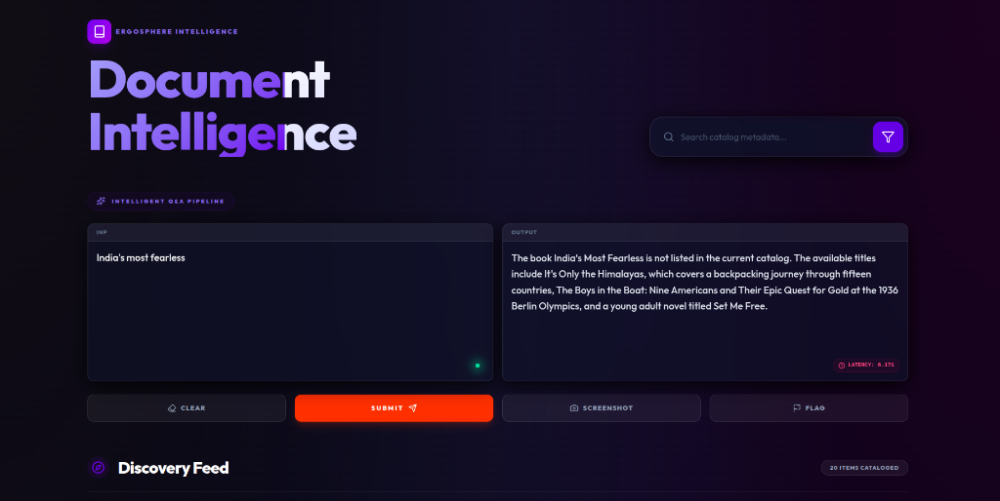
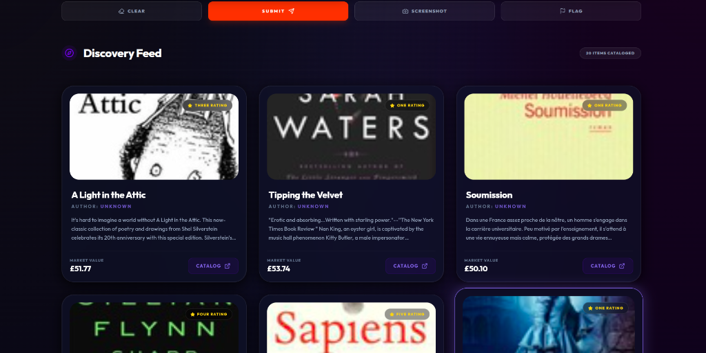
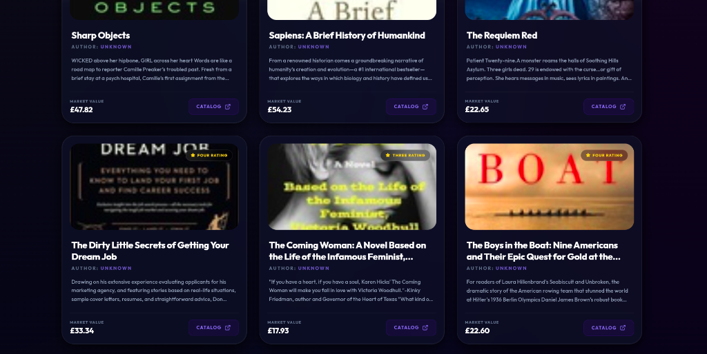
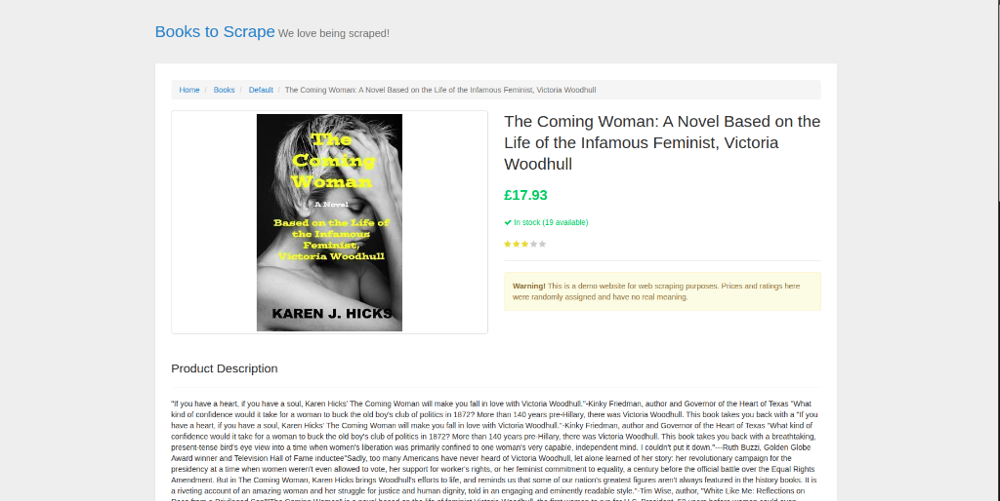

# AI-Powered Book Insight Platform

A full-stack application built for the Ergosphere assignment. It features automated book data collection, a Django REST backend with RAG capabilities, and a premium React-based dashboard.

## 🚀 Features
- **Data Automation**: Headless Selenium scraper for book metadata.
- **AI Insights**: RAG-enabled chat interface for querying book content.
- **Premium UI**: Glassmorphism design with Tailwind CSS and Framer Motion.
- **Full-Stack**: Django REST Framework + Vite/React.

## 🛠️ Setup Instructions

### Backend
1. Navigate to `/backend`.
2. Create and activate a virtual environment:
   ```bash
   python3 -m venv venv
   source venv/bin/activate
   ```
3. Install dependencies:
   ```bash
   pip install django djangorestframework django-cors-headers PyMySQL openai selenium webdriver-manager
   ```
4. Run migrations:
   ```bash
   python manage.py migrate
   ```
5. Start the server:
   ```bash
   python manage.py runserver
   ```

### Frontend
1. Navigate to `/frontend`.
2. Install dependencies:
   ```bash
   npm install
   ```
3. Start the development server:
   ```bash
   npm run dev
   ```

### Scraper
1. To fetch new data, activate the backend venv and run:
   ```bash
   python scraper/scrape.py
   ```

## 📂 Project Structure
- `backend/`: Django REST project.
- `frontend/`: Vite + React + Tailwind CSS project.
- `scraper/`: Selenium automation scripts.
- `screenshots/`: Project visuals.

## 📸 Screenshots

### 🧠 Intelligent Q&A Interface


### 📚 Document Discovery Feed



### 🌐 Data Source (Books to Scrape)

